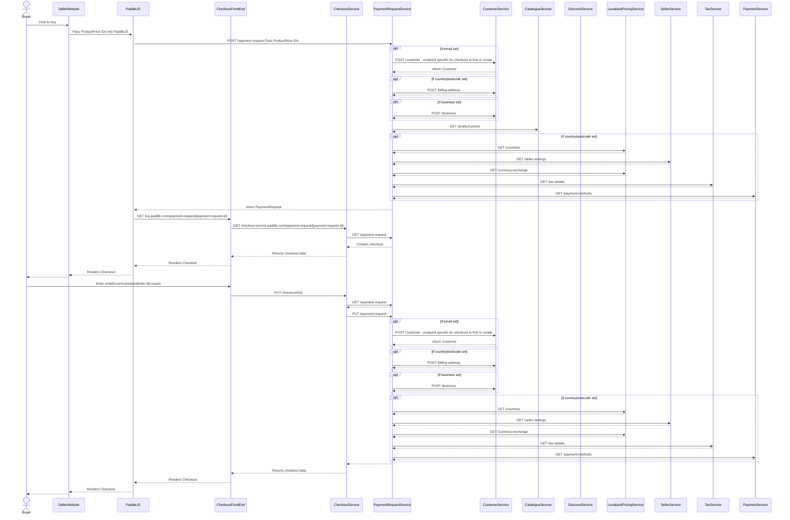

# Payment Request Scenarios

```mermaid
sequenceDiagram
    %% ProductPrice needs renaming - maybe to plan or something else
    Actor Buyer
    participant SellerWebsite
    participant PaddleJS
    participant CheckoutFrontEnd
    participant CheckoutService
    participant PaymentRequestService
    participant CustomerService
    participant CatalogueService
    participant DiscountService
    participant LocalisedPricingService
    participant SellerService
    participant TaxService
    participant PaymentService

    Buyer->>SellerWebsite: Click to buy
    SellerWebsite->>+PaddleJS: Pass ProductPrice IDs into PaddleJS
    PaddleJS->>PaymentRequestService: POST /payment-request Pass ProductPrice IDs

    opt if email set
        PaymentRequestService->>CustomerService: POST /customer - endpoint specific for checkout to find or create
        CustomerService-->>PaymentRequestService: return Customer
    end

    opt if country/postcode set
        PaymentRequestService->>CustomerService: POST /billing-address
        CustomerService-->>PaymentRequestService: 
    end

    opt if business set
        PaymentRequestService->>CustomerService: POST /business
        CustomerService-->>PaymentRequestService: 
    end

    PaymentRequestService->>CatalogueService: GET /product-prices
    CatalogueService-->>PaymentRequestService: 

    opt if country/postcode set
        PaymentRequestService->>LocalisedPricingService: GET /countries
        LocalisedPricingService-->>PaymentRequestService: 
        PaymentRequestService->>SellerService: GET /seller-settings
        SellerService-->>PaymentRequestService: 
        PaymentRequestService->>LocalisedPricingService: GET /currency-exchange
        LocalisedPricingService-->>PaymentRequestService: 
        PaymentRequestService->>TaxService: GET /tax-details
        TaxService-->>PaymentRequestService: 
        PaymentRequestService->>PaymentService: GET /payment-methods
        PaymentService-->>PaymentRequestService: 
    end
    PaymentRequestService-->>PaddleJS: return PaymentRequest
    PaddleJS->>CheckoutFrontEnd: GET buy.paddle.com/payment-request/{payment-request-id}
    CheckoutFrontEnd->>CheckoutService: GET checkout-service.paddle.com/payment-request/{payment-request-id}
    CheckoutService->>PaymentRequestService: GET /payment-request
    PaymentRequestService-->>CheckoutService: Creates checkout
    CheckoutService-->>CheckoutFrontEnd: Returns checkout data
    CheckoutFrontEnd-->>PaddleJS: Renders Checkout
    PaddleJS-->>SellerWebsite: Renders Checkout
    SellerWebsite-->>Buyer: 

    Buyer->>CheckoutFrontEnd: Enter email/country/postcode/tax id/coupon
    CheckoutFrontEnd->>CheckoutService: PUT /checkout/{id}
    CheckoutService->>PaymentRequestService: GET /payment-request
    PaymentRequestService-->>CheckoutService: 

    CheckoutService->>PaymentRequestService: PUT /payment-request

    opt if email set
        PaymentRequestService->>CustomerService: POST /customer - endpoint specific for checkout to find or create
        CustomerService-->>PaymentRequestService: return Customer
    end

    opt if country/postcode set
        PaymentRequestService->>CustomerService: POST /billing-address
        CustomerService-->>PaymentRequestService: 
    end

    opt if business set
        PaymentRequestService->>CustomerService: POST /business
        CustomerService-->>PaymentRequestService: 
    end

    

    opt if country/postcode set
        PaymentRequestService->>LocalisedPricingService: GET /countries
        LocalisedPricingService-->>PaymentRequestService: 
        PaymentRequestService->>SellerService: GET /seller-settings
        SellerService-->>PaymentRequestService: 
        PaymentRequestService->>LocalisedPricingService: GET /currency-exchange
        LocalisedPricingService-->>PaymentRequestService: 
        PaymentRequestService->>TaxService: GET /tax-details
        TaxService-->>PaymentRequestService: 
        PaymentRequestService->>PaymentService: GET /payment-methods
        PaymentService-->>PaymentRequestService: 
    end

    PaymentRequestService-->>CheckoutService: 
    CheckoutService-->>CheckoutFrontEnd: Returns checkout data
    CheckoutFrontEnd-->>PaddleJS: Renders Checkout
    PaddleJS-->>SellerWebsite: Renders Checkout
    SellerWebsite-->>Buyer: 
```