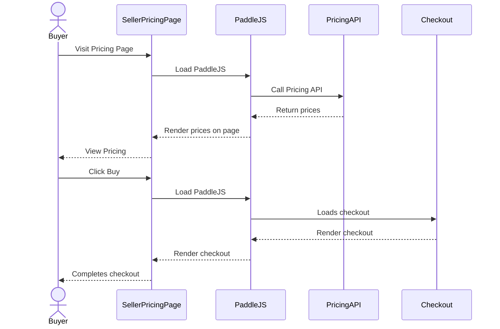
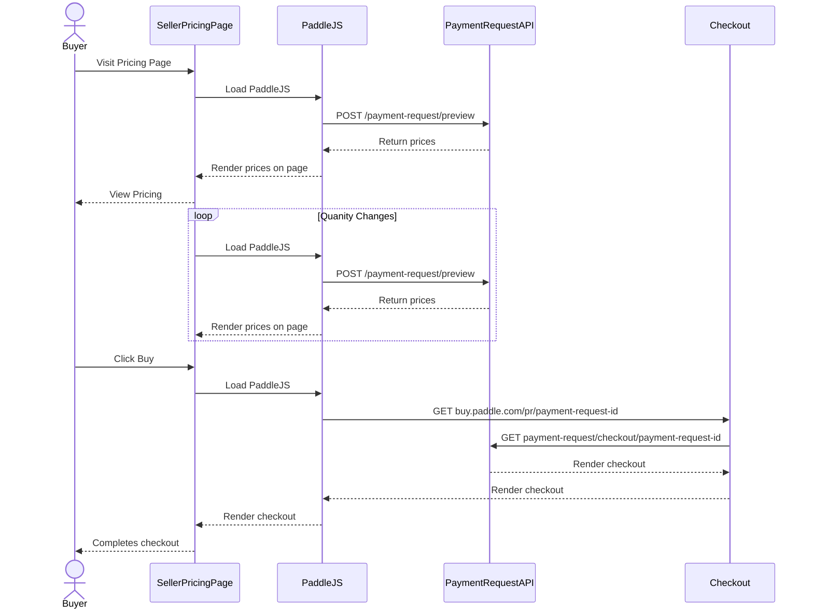

# Workshop stuff

## Existing Pricing API/PaddleJS/Checkout

```mermaid
sequenceDiagram
    Actor Buyer
    Buyer->>SellerPricingPage: Visit Pricing Page
    SellerPricingPage->>PaddleJS: Load PaddleJS
    PaddleJS->>PricingAPI: Call Pricing API
    PricingAPI-->>PaddleJS: Return prices
    PaddleJS-->>SellerPricingPage: Render prices on page
    SellerPricingPage-->>Buyer: View Pricing
    
    Buyer->>SellerPricingPage: Click Buy
    SellerPricingPage->>PaddleJS: Load PaddleJS
    PaddleJS->>Checkout: Loads checkout
    Checkout-->>PaddleJS: Render checkout
    PaddleJS-->>SellerPricingPage: Render checkout
    SellerPricingPage-->>Buyer: Completes checkout
```

```mermaid
sequenceDiagram
    Actor Buyer
    Buyer->>SellerPricingPage: Visit Pricing Page
    SellerPricingPage->>PaddleJS: Load PaddleJS
    PaddleJS->>PaymentRequestAPI: POST /payment-request/preview
    PaymentRequestAPI-->>PaddleJS: Return prices
    PaddleJS-->>SellerPricingPage: Render prices on page
    SellerPricingPage-->>Buyer: View Pricing

    loop Quanity Changes
        SellerPricingPage->>PaddleJS: Load PaddleJS
        PaddleJS->>PaymentRequestAPI: POST /payment-request/preview
        PaymentRequestAPI-->>PaddleJS: Return prices
        PaddleJS-->>SellerPricingPage: Render prices on page
    end
    
    Buyer->>SellerPricingPage: Click Buy
    
    SellerPricingPage->>PaddleJS: Load PaddleJS
    PaddleJS->>Checkout: GET buy.paddle.com/pr/payment-request-id
    Checkout->>PaymentRequestAPI: GET payment-request/checkout/payment-request-id
    PaymentRequestAPI-->>Checkout: Render checkout
    Checkout-->>PaddleJS: Render checkout
    PaddleJS-->>SellerPricingPage: Render checkout
    SellerPricingPage-->>Buyer: Completes checkout
```